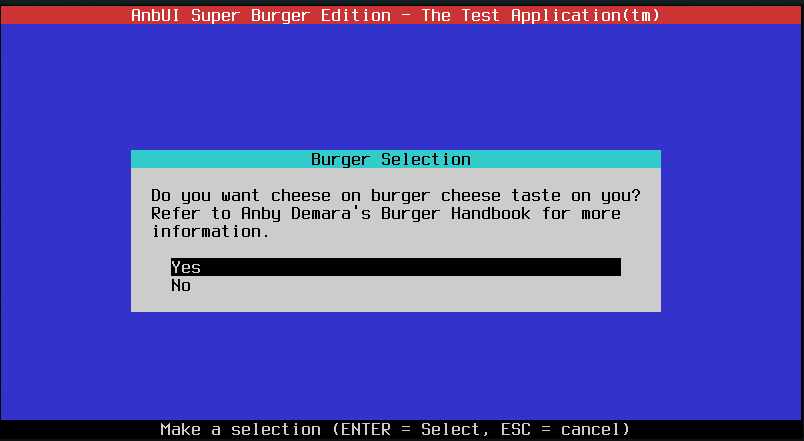
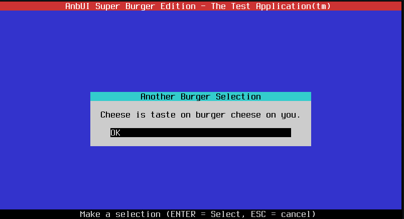
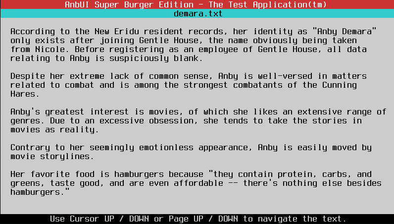
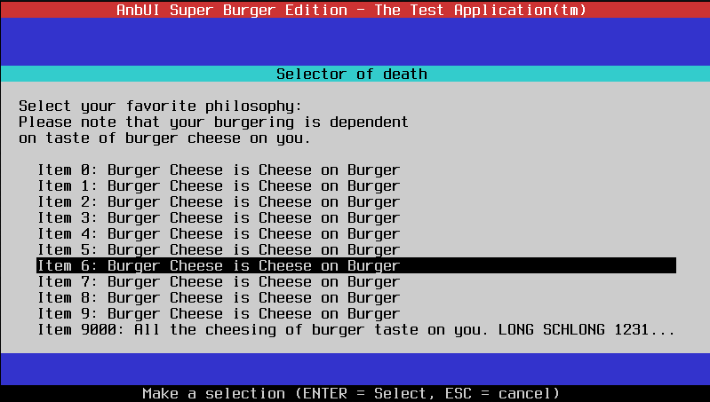
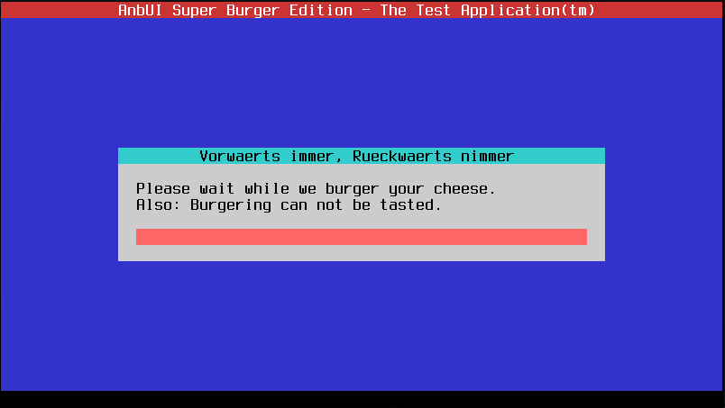

# AnbUI - The Burger Enjoyers' Minimal Text UI Library In C

This does pretty much what it says on the tin... It's a miniature text library in C!

It's designed with absolute ease of use in mind. One or two function calls to get the kind of TUI element you want.

## What can it do?

* Menus
    * Menus with arbitrary items, generated at run time
    * Yes/No Selectors
    * OK message boxes
* Text file display boxes
* Command output display boxes
* Progress bar boxes

A lot of functions support variadic arguments so you don't need to prepare strings to pass to it via temporary buffers and sprintfs.

As I said, minimal code & ease of use is the focus here.

## Limitations

* Currently the screen size is fixed to 80x25 (aka. VGA Text Mode) displays, because that's what I made the library for. Sorry! :(

* Probably currently not very thread-safe (at all (please don't))

## API Reference

Coming when I'm bored! Please check the test code in anbui.c for now :D

## What's with the name...?

My partner plays a video game called Zenless Zone Zero. I It's not my type of game, but it has a character named Anby Demara. This character has an unholy obsession with burgers, which I relate to :D

That's where AnbUI and all the references come from.

## Screenshots

## License

I've been a professional software engineer for quite a few years now and I still don't know sh*t about licensing.

CC-BY-NC 3.0 says use it, copy it, tell people who made it and don't sell it. Pretty please? :3